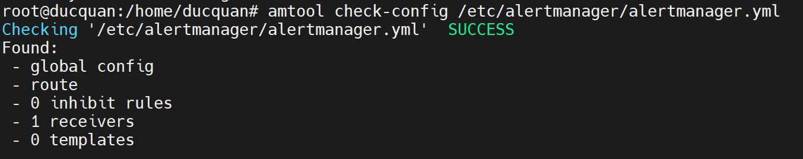

# SET UP ALERT MANAGER VÀ KẾT NỐI NÓ VỚI PROMETHEUS.

NHỚ SUDO VÀO QUYỀN ROOT TRƯỚC NHA.

## I. CÀI ĐẶT ALERT MANAGER.

TA CÓ THỂ CÀI TRÊN SERVER NÀO CŨNG ĐƯỢC NHA. TIỆN CỨ CÀI CHUNG TRÊN SERVER CHỨA PROMETHEUS CŨNG OKE MÀ.


### BƯỚC 1: KHỞI TẠO USER.


`useradd --no-create-home --shell /bin/false alertmanager`


### BƯỚC 2: CÀI ALERT MANAGER.


```
cd /opt
wget https://github.com/prometheus/alertmanager/releases/download/v0.26.0/alertmanager-0.26.0.linux-amd64.tar.gz

tar xzf alertmanager-0.26.0.linux-amd64.tar.gz

mv alertmanager-0.26.0.linux-amd64/alertmanager /usr/local/bin/
mv alertmanager-0.26.0.linux-amd64/amtool /usr/local/bin/

chown alertmanager:alertmanager /usr/local/bin/alertmanager
chown alertmanager:alertmanager /usr/local/bin/amtool

mkdir /etc/alertmanager
chown alertmanager:alertmanager /etc/alertmanager

```


### BƯỚC 3: CẤU HÌNH CHO ALERY MANAGER.


`vi /etc/alertmanager/alertmanager.yml`: tạo file cấu hình:


sau đó điền đoạn mã sau đây vào:
```

route:
  group_by: [Alertname]
# Send all notifications to me.
  receiver: email-me
receivers:
- name: email-me
  email_configs:
  - to: email nhận
    from: email gửi
    smarthost: smtp.gmail.com:587
    auth_username: "email gửi"
    auth_identity: "email gửi"
    auth_password: "mật khẩu ứng dụng của email gửi" # tự xem phần tạo mật khẩu ứng dụng cho gmail.

```

### BƯỚC 4: TẠO FILE SYSTEM.


`sudo vi /etc/systemd/system/alertmanager.service` tạo file

sau đó điền đoạn mã sau đây vào:
```

[Unit]
Description=Alertmanager
Wants=network-online.target
After=network-online.target

[Service]
User=alertmanager
Group=alertmanager
Restart=always
Type=simple
WorkingDirectory=/etc/alertmanager/
ExecStart=/usr/local/bin/alertmanager --config.file=/etc/alertmanager/alertmanager.yml --web.external-url http://localhost:9093 

[Install]
WantedBy=multi-user.target

```

SAU KHI SONG, TA CÓ THỂ KIỂM TRA XEM OKE CHƯA BẰNG CÁCH:

`amtool check-config /etc/alertmanager/alertmanager.yml`: câu lệnh kiểm tra.

thấy nó print ra như này là oke nha: 




###  BƯỚC 5: KHỞI TẠO DỊCH VỤ;


```

sudo systemctl daemon-reload
sudo systemctl start alertmanager.service
sudo systemctl enable alertmanager.service
sudo systemctl status alertmanager.service
sudo sudo systemctl restart alertmanager.service

```


### BƯỚC 6: KIỂM TRA LOG CỦA ALERMANGER.

`journalctl -u alertmanager -f`: lệnh kiểm tra log.


thấy nó println ra ntn là oke. nếu lỗi. khả năng cao là lỗi ở đoạn cấu hình mấy cái mail vào đó. và nhớ restart dịch vụ nhá.


## II. KẾT NỐI NÓ VỚI PROMETHEUS. 


### BƯỚC 1: CẦN PHẢI CÓ 1 FILE CẤU HÌNH ĐỂ MÀ NÓ BIẾT SỰ KIỆN NÀO CẦN THÔNG BÁO.


`vi /etc/prometheus/alert.rules.yml`: tạo file rules.

Sau đó ta sẽ thêm rule vào file. ví dụ rule sau chỉ định cứ server nào bị down, bị tắt nó sẽ thông báo.

```
groups:
- name: Instances
  rules:
  - alert: InstanceDown
    expr: up == 0
    for: 10s
    labels:
      severity: page
    annotations:
      description: '{{ $labels.instance }} of job {{ $labels.job }} has been down for more than 10 s.'
      summary: 'Instance {{ $labels.instance }} down'

```

SAU ĐÓ TA SẼ PHÂN QUYỀN LẠI FILE.

`chown prometheus:prometheus /etc/prometheus/alert.rules.yml`: lệnh phân quyền.


KIỂM TRA XEM OKE CHƯA

`promtool check rules /etc/prometheus/alert.rules.yml`: check kiểm tra.

nếu nó println ra thế này là oke nha.


### BƯỚC 2: KHAI BÁO VỚI PROMETHEUS.


ta cần sửa file config prometheus để kết nối với alrt manager.


`vi /etc/prometheus/prometheus.yml`: sửa file config

NỐI TIẾP CÁI NÀY VÀO FILE 

```
rule_files:
  - alert.rules.yml

alerting:
  alertmanagers:
  - static_configs:
    - targets:
      - địa chỉ ip server chứa alert manager:9093

```

### BƯỚC 3: KHỞI ĐỘNG LẠI PROMETHEUS.


```
systemctl restart prometheus
systemctl status prometheus

```

## III.KIỂM TRA.

ta sẽ tắt con server đi nha( vì file cấu hình rule của ta là tắt đi thì thông báo mà:)))


sau khi tắt đi, trên prometheus đã hiện có 1 con instant bị down r nha.


trên alert manager đã hiện.


---

*Danh mục tài liệu tham khảo:*

[1] with docker https://fixloinhanh.com/cau-hinh-canh-bao-tren-prometheus-alertmanager-telegram/

[2] https://blog.devopsviet.com/2023/09/17/prometheus-part-3-huong-dan-trien-khai-alert-manager-tren-ubuntu-20-04/
