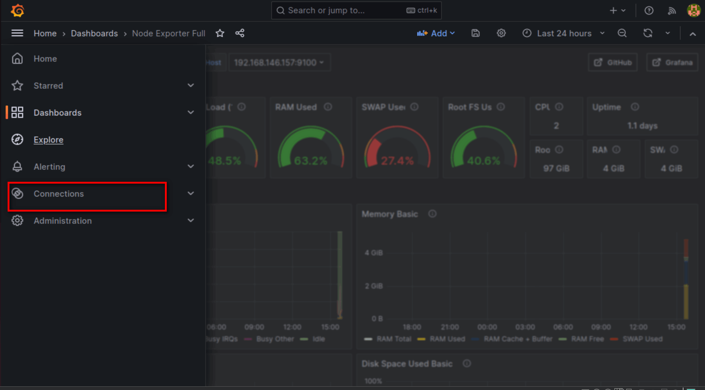
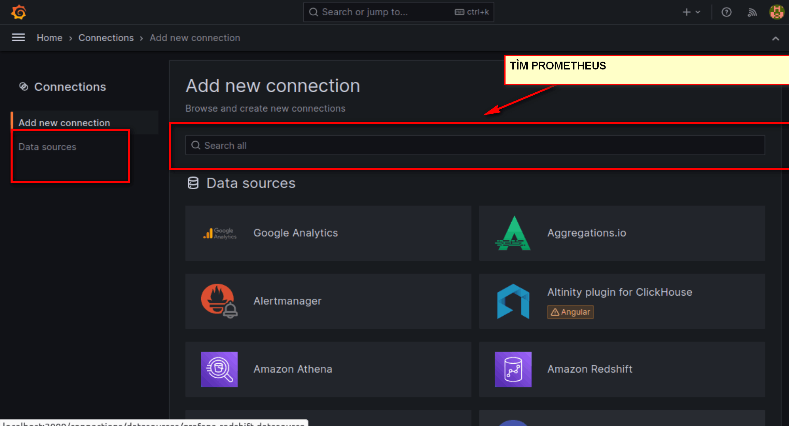
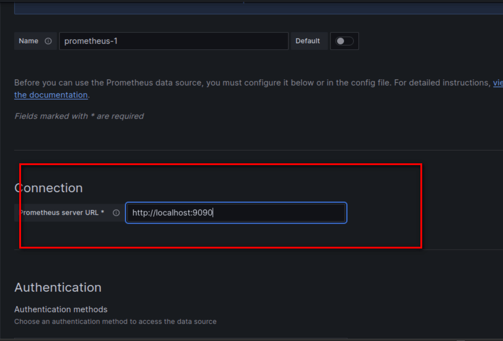
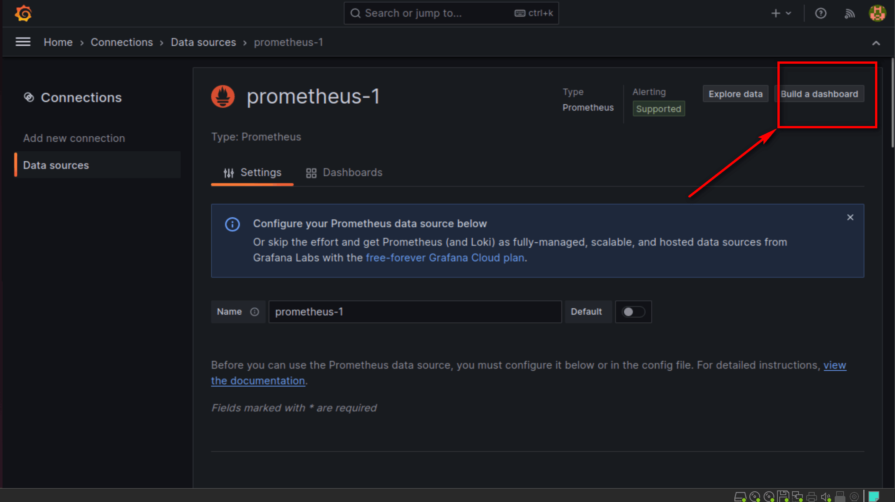
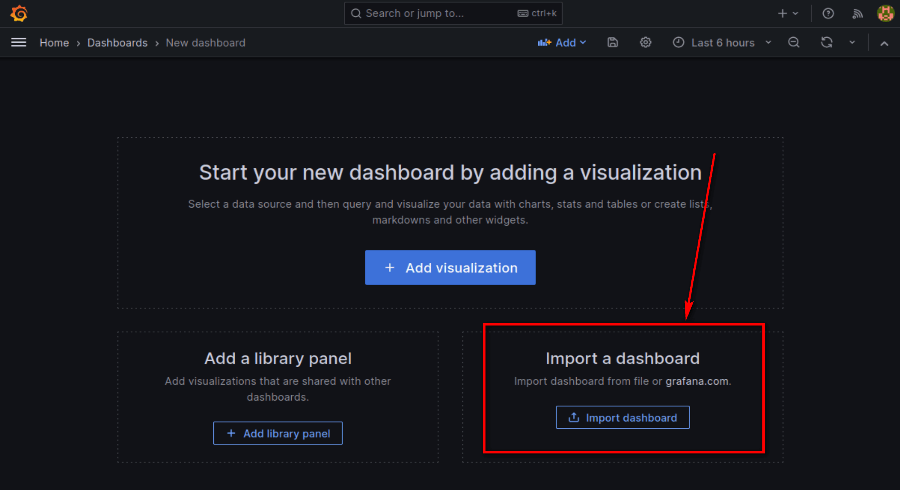
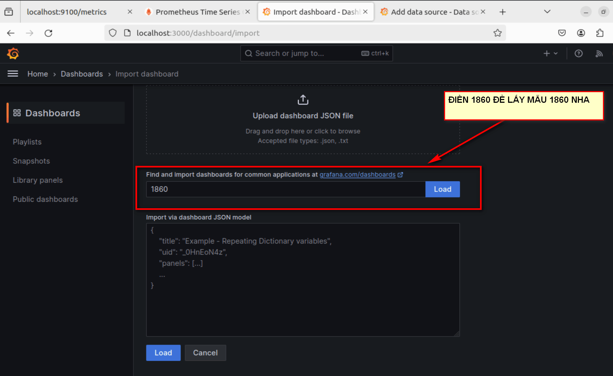
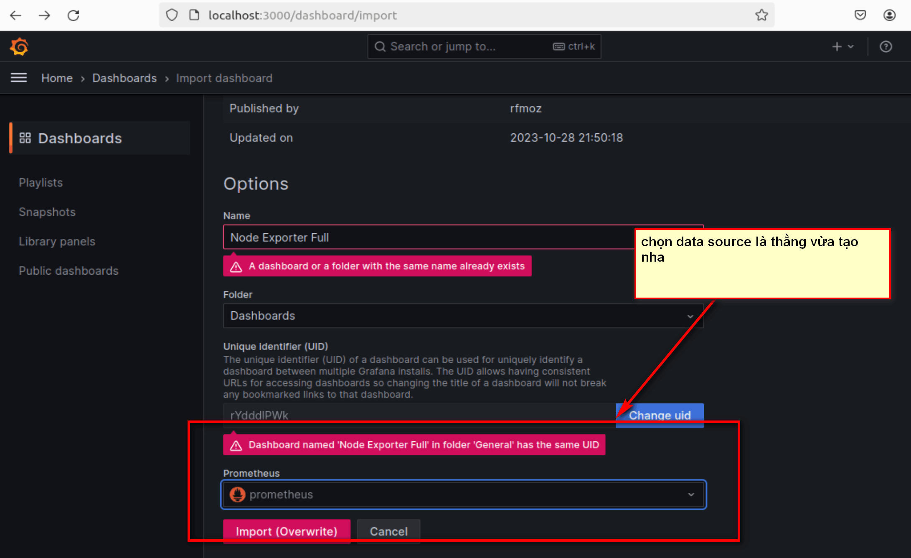
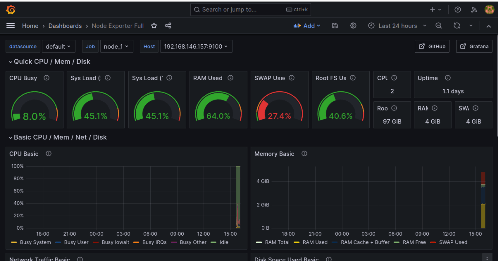

# CÀI ĐẶT GRAFANA VÀ KẾT NỐI NÓ VỚI PROMETHEUS.


## I. CÀI ĐẶT GRAFANA.


### BƯỚC 1: UPDATE

```
sudo apt update
sudo apt-get install -y gnupg2 curl 
sudo apt-get install -y apt-transport-https
sudo apt-get install -y software-properties-common wget

```
### BƯỚC 2: BỔ SUNG KHÓA.

```
wget -q -O - https://packages.grafana.com/gpg.key | sudo apt-key add -
echo "deb https://packages.grafana.com/oss/deb stable main" | sudo tee -a /etc/apt/sources.list.d/grafana.list

```

### BƯỚC 3:  CÀI GRFANA VÀ KHỞI CHẠY
```

sudo apt-get update
sudo apt-get -y install grafana

sudo systemctl enable --now grafana-server

```

## II. KẾT NỐI VỚI PROMETHEUS.











---

*Danh mục tài liệu tham khảo*


