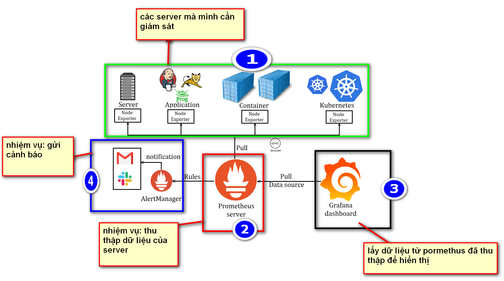

# TỔNG QUAN VỀ GRAFANA.

## I. GIỚI THIỆU.

Grafana là một giao diện/dashboard theo dõi hệ thống. CHỈ CHỈ GIÚP TRỰC QUAN HÓA DỮ LIỆU KHÔNG GIÚP THU THẬP DỮ LIỆU.

ĐẦU VÀO LÀ DỮ LIỆU TỪ HỆ THỐNG SERVER LINUX,AWS... THƯỜNG DỮ LIỆU NÀY SẼ ĐƯỢC LẤY BỞI 1 BÊN THỨ 3 THU THẬP ĐÓ LÀ PROMETHOS.

ĐẦU RA LÀ CẢNH BÁO QUA MAIL, TELEGRAM VÀ STACK.

## II. CÁCH HOẠT ĐỘNG.

KIẾN TRÚC MONITORING VỚI GRAFANA SẼ CÓ 4 THÀNH PHẦN CHÍNH NHƯ SAU:

- SERVER: NHỮNG THỨ MÀ TA PHẢI GIÁM SÁT.

- PROMETHUS: CÔNG CỤ THU THẬP DỮ LIỆU, LẤY METRIC QUA SERVER.

- GRAFANA: NƠI HIỂN THỊ DỮ LIỆU THU THẬP ĐƯỢC TỪ PROMETHUS

- ALERMANAGER: CÔNG CỤ HỖ TRỢ CẢNH BÁO QUA MAIL, TELE.

