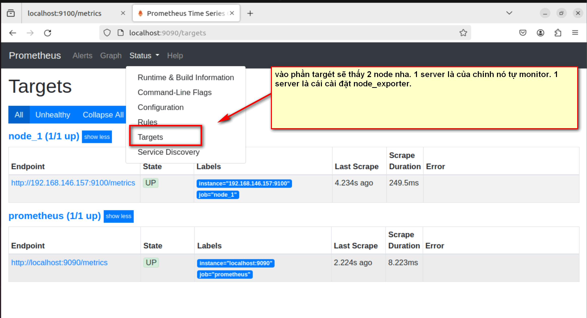

# CÀI ĐẶT NODE EXPORTER VÀ KẾT NỐI NÓ VỚI PROMETHEUS.

## I. CÀI NODE EXPORTER.

CÀI NODE EXPORTER TRÊN SERVER CẦN GIÁM SÁT.


### BƯỚC 1:TẠO USER.

`useradd --no-create-home --shell /bin/false node_exporter`


### BƯỚC 2: CÀI NODE EXPORTER.

```

wget https://github.com/prometheus/node_exporter/releases/download/v1.6.1/node_exporter-1.6.1.linux-amd64.tar.gz
tar xzf node_exporter-1.6.1.linux-amd64.tar.gz
sudo mv -v node_exporter-1.6.1.linux-amd64/node_exporter /usr/local/bin/
sudo chown node_exporter:node_exporter /usr/local/bin/node_exporter
node_exporter --version

```


### BƯỚC 3: TẠO FILE FILE SYSTEM

`sudo vi /etc/systemd/system/node-exporter.service`: tạo file

Sau đó thêm nội dung sau vào file
```

[Unit]
Description=Node Exporter
After=network.target

[Service]
User=node_exporter
Group=node_exporter
Type=simple
ExecStart=/usr/local/bin/node_exporter --collector.systemd

[Install]
WantedBy=multi-user.target

```


### BƯỚC 4: KHỞI CHẠY DỊCH VỤ:


```
sudo systemctl daemon-reload
sudo systemctl start node-exporter.service
sudo systemctl enable node-exporter.service
sudo systemctl status node-exporter.service

```

LƯU Ý: NẾU PORT ĐÃ BỊ CHIỂM THÌ TA CẦN KILL PORT ĐÓ ĐI.

`sudo netstat -tulpn | grep :9100`: tìm ra cổng 9100.

`sudo kill <PID>`: kill tiến trình đã chiếm cổng đó đi.


## II. KẾT NỐI EXPORTER VỚI SERVER PROMETHEUS

TA SẼ CHUYỂN SANG CON SERVER CHỨA PROMETHEUS

### BƯỚC 1: SỬA FILE CẤU HÌNH PROMETHEUS THÊM CON SERVER MỚI CẦN THEO DÕI VÀO.


`vi /etc/prometheus/prometheus.yml `: SỬA FILE CẤU HÌNH.

THÊM ĐOẠN SAU VÀO:

```
 - job_name: 'node_1'
    scrape_interval: 5s
    static_configs:
      - targets: ['IP MÁY CẦN THEO DÕI ĐÃ CÀI NODE EXPORTER:9100']

```
LÚC NÀY FILE SẼ KIỂU:


cat <<EOF > /etc/prometheus/prometheus.yml

global:
  scrape_interval: 15s

scrape_configs:
  - job_name: 'prometheus'
    scrape_interval: 5s
    static_configs:
      - targets: ['localhost:9090']
  - job_name: 'node_1'
    scrape_interval: 5s
    static_configs:
      - targets: ['192.168.146.157:9100']

EOF


### BƯỚC 2: KHỞI ĐỘNG LẠI PROMETHEUS.


`systemctl restart prometheus`: KHỞI ĐỘNG LẠI.





---

*DANH MỤC THAM KHẢO*

[1] https://blog.devopsviet.com/2023/09/17/prometheus-part-2-huong-dan-trien-khai-node-export-tren-ubuntu-20-04/