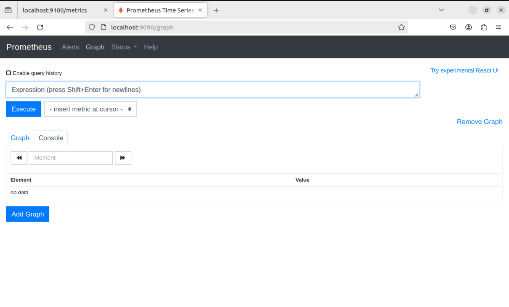

# CÀI ĐẶT PROMETHEUS TRÊN UBUNTU.


## I. CÀI ĐẶT.
### BƯỚC 1: INSTALL PROMETHEUS.
```
sudo apt update
sudo apt install prometheus
```


### BƯỚC 2: KHỞI ĐỘNG.


```
sudo systemctl start prometheus : lệnh khở động
```

LƯU Ý: NẾU MUỐN NGẮT ``


## II. CẤU HÌNH.


### BƯỚC 1: KHỞI TẠO USER.

TA SẼ BẮT ĐẦU BẰNG VIỆC TẠO 1 NHÓM NGƯỜI SỬ DỤNG PROMETHEUS

`sudo groupadd --system prometheus`: TẠO NHÓM

`sudo useradd -s /sbin/nologin --system -g prometheus prometheus`: THÊM NG DÙNG VÔ NHÓM


### BƯỚC 1: TẢI GÓI WGET VỀ MÁY ĐỂ DÙNG LỆNH WGET NẾU CHƯA CÓ.

```
wget https://github.com/prometheus/prometheus/releases/download/v2.22.0/prometheus-2.22.0.linux-amd64.tar.gz

tar -xvf prometheus-2.22.0.linux-amd64.tar.gz

mv prometheus-2.22.0.linux-amd64 prometheus-files


```


### BƯỚC 2: TẠO THƯ MỤC LƯU TRỮ, CẤU HÌNH.


```

sudo mkdir /etc/prometheus
sudo mkdir /var/lib/prometheus
sudo chown prometheus:prometheus /etc/prometheus
sudo chown prometheus:prometheus /var/lib/prometheus

```

sau đó , Sao chép tệp nhị phân prometheus và prometheus từ thư mục tệp prometheus sang /usr/local/bin và thay đổi quyền sở hữu thành người dùng prometheus.


```

sudo cp prometheus-files/prometheus /usr/local/bin/ 
sudo cp prometheus-files/promtool /usr/local/bin/ 
sudo chown prometheus:prometheus /usr/local/bin/prometheus 
sudo chown prometheus:prometheus /usr/local /bin/promtool

```


Tiếp tục Di chuyển các thư mục console và console_libraries từ tệp prometheus sang thư mục /etc/prometheus và thay đổi quyền sở hữu thành người dùng prometheus.


```
sudo cp -r prometheus-files/consoles /etc/prometheus
sudo cp -r prometheus-files/console_libraries /etc/prometheus
sudo chown -R prometheus:prometheus /etc/prometheus/consoles
sudo chown -R prometheus:prometheus /etc/prometheus/console_libraries

```

### BƯỚC 3: TẠO FILE CONFIG.

`sudo vi /etc/prometheus/prometheus.yml`: TẠO TỆP CẤU HÌNH.

sao chép nội dung sau vào file. mục đích là để nó tự monitor chính nó.


```
dock
```


sau đó ta sẽ thay đổi quyền sở hữu tệp thành người dùng prometheus.


`sudo chown prometheus:prometheus /etc/prometheus/prometheus.yml`: lệnh thay đổi quyền sở hữu.


### BƯỚC 4: THÊM FILE SYSTEM.


`sudo vi /etc/systemd/system/prometheus.service`: tạo file system.

Điền nội dung sau vào file.


```

[Unit]
Description=Prometheus
Wants=network-online.target
After=network-online.target

[Service]
User=prometheus
Group=prometheus
Restart=always
Type=simple
ExecStart=/usr/local/bin/prometheus \
    --config.file=/etc/prometheus/prometheus.yml \
    --storage.tsdb.path=/var/lib/prometheus/ \
    --web.console.templates=/etc/prometheus/consoles \
    --web.console.libraries=/etc/prometheus/console_libraries \
    --web.listen-address=0.0.0.0:9090

[Install]
WantedBy=multi-user.target

```

### BƯỚC 5: KHỞI TẠO DỊCH VỤ

```
sudo systemctl start prometheus
sudo systemctl enable prometheus
sudo systemctl status prometheus

```

truy cập: http://localhost:9090/




---

*Danh mục tham khảo*

[1] https://blog.devopsviet.com/2023/09/17/prometheus-part-1-huong-dan-cai-dat-prometheus-voi-ubuntu-20-04

[2] https://tuanntblog.com/cai-dat-prometheus-va-chay-prometheus-nhu-mot-dich-vu-service-tren-ubuntu-20-04/


