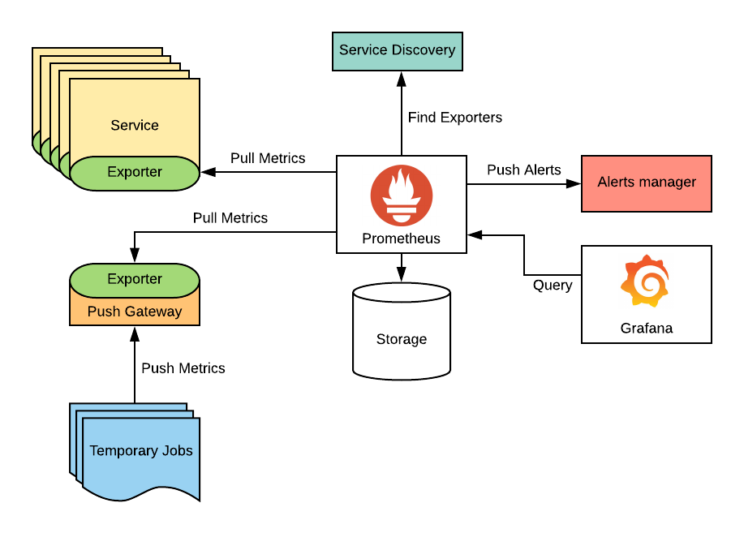

# PROMETHENUS

## I GIỚI THIỆU.

PROMETHUS KHÔNG THU THẬP DỮ LIỆU LOG. NÓ CHỈ THU THẬP DỮ LIỆU METRIC.

## II. KIẾN TRÚC.

### SƠ LƯỢC NHIỆM VỤ CỦA CÁC THÀNH PHẦN:

1. SERVICE & TEMPORARY JOB: các service mà prometheus cần quản lý. các service cùng chung nhiệm vụ sẽ tạo thành 1 job.

2. PUSH GATEWAY: bộ phận lấy ra dữ liệu mà không thể push được metric

3. EXPORTER: lấy dữ liệu từ thằng số 1,2. mục đích của nó là tính toán metric

4. PROMETHEUS: tổng hợp các metric lại, lưu trữ nó.

5. GRAFANA: QUERY DỮ LIỆU TỪ DATABASE CỦA PROMETHEUS VÀ HIỂN THỊ NÓ.

6. ALERTS MANAGER: nó gửi dữ liệu đi 1 nơi nào đó, ví dụ như mail.
## II. METRIC

`<metric name>{<label name>=<label value>, ...}`: biểu thưc metric

Có bốn kiểu metric được sử dụng trong prometheus:

counter: là một số bộ đếm tích lũy, được đặt về 0 khi restart. Ví dụ, có thể dùng counter để đếm số request được phục vụ, số lỗi, số task hoàn thành,... Không sử dụng cho các metric có gia trị giảm như số tiến trình đang chạy. Trong trường hợp đó, ta có thể sử dụng gauge.

gauge: đại diện cho số liệu duy nhất, nó có thể lên hoặc xuống, thường được sử dụng cho các giá trị đo.

histogram: lấy mẫu quan sát (thường là những thứ như là thời lượng yêu cầu, kích thước pahnr hồi). Nó cũng cung cấp tổng của các giá trị đó.

summary: tương tự histogram, nó cung cấp tổng số các quan sát và tổng các giá trị đó, nó tính toàn số lượng có thể cấu hình qua sliding time window (cửa sổ trượt).

## III. FILE CẤU HÌNH PROMETHEUS.YAML

đây là file cấu hình chính của Prometheus. Nó được sử dụng để cấu hình các mục tiêu thu thập metric, các quy tắc ghi và cảnh báo, và các cấu hình khác. 

tệp gồm các thành phần sau:
- global: Chứa các cấu hình toàn cục cho Prometheus, bao gồm các cấu hình cho các trình thu thập metric, các quy tắc ghi và cảnh báo, và các cấu hình khác.
- rule_files: Chứa danh sách các tệp chứa các quy tắc ghi và cảnh báo.
- scrape_configs: Chứa danh sách các mục tiêu thu thập metric và các cấu hình liên quan.

